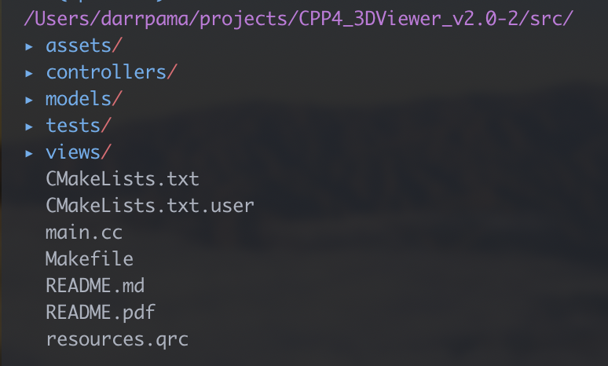

`3D Viewer v2.0` это приложение для визуализации 3D объектов, представленных в формате `.obj`.

## Установка
Для установки в директорию `src` перейдите в папку `src` и вызовите команду `make install` и проигнорируйте указание пути.
```bash
cd src
make install
```

В папке `src` появится приложение `3DViewer_2_0.app`

Для установки без запуска перейдите в папку `src` и вызовите команду `make build`.
```bash
make build
```

Для установки в произвольную директорию вызовите команду `make install` и введите путь.
```bash
make install
```

Для запуска тестов в папке `src` вызовите команду `make tests`.
```bash
make tests
```

Для удаления программы в папке `src` вызовите команду `make uninstall`.
```bash
make uninstall
```

Для корректной сборки на компьютере должен быть установлен пакет библиотек `Qt`, библиотека `googletest` и утилита `cmake`.

После запуска тестов можно удалить временные файлы, в том числе папку с билдом, командой `make clean`
```bash
make clean
```
## Интерфейс


Приложение состоит из одного окна. В левой части расположен виджет для просмотра модели, в правой части находятся кнопки для создания скриншота и записи скринкаста, окна с параметрами отображения модели и виджет с информацией об отображаемом объекте.

Под виджетом для просмотра расположена кнопка для загрузки модели, справа от кнопки отображается путь до текущего открытого файла.

## Структура проекта

Проект реализован с использованием паттерна проектирования `MVC` и таких паттернов как `Singleton` в контроллере, `Facade` в модели и `Strategy` при создании скриншотов.

Все исходные файлы проекта находятся в папке `src`. Её содержимое:
 
* `assets` - иконки, тестовые объекты и скриншоты данного README;
* `controllers` - реализация контроллера, связывающего модель и графический интерфейс;
* `models` - реализация парсинга `.obj` файлов, шейдеры, а также всё, чтобы отобразить изображение в QtOpenGL виджете;
* `tests` - тесты для наших функций;
* `views` - файлы с графическим интерфейсом;
* `CMakeLists.txt`- файл для генерации дополнительного Makefile, который осуществляет сборку всего приложения;
* `main.cc`- файл, содержащий функцию `main()` и создающий все сущности, которые используются в приложении в дальнейшем;
* `Makefile` - главный мейкфайл всего проекта, позволяет запускать цели `all, install, uninstall, clean, dvi, dist, tests`.

## Лицензия

[MIT](https://choosealicense.com/licenses/mit/)