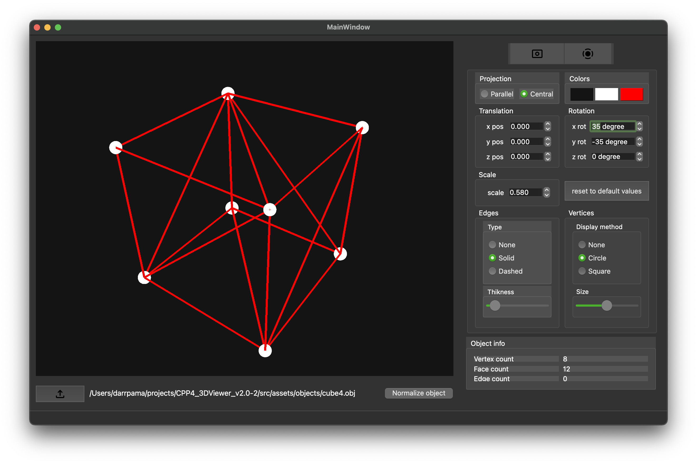

# 3D Viewer v2.0 by myregree, darrpama and festusst

`3D Viewer v2.0` это приложение для визуализации 3D объектов, представленных в формате `.obj`.

## Установка
Для установки перейдите в папку `src` и вызовите команду `make install`.

```bash
cd src
make install
```

После установки можно удалить временные файлы командой `make clean`

Для корректной сборки на компьютере должен быть установлен пакет библиотек `Qt` и `cmake`.

Для удаления программы перейдите в папку `src` и вызовите команду `make uninstall`.

```bash
cd src
make uninstall
```

## Запуск
Приложение установится в папку `src/build`, для запуска вызовите команду `make open`

```bash
make open
```

## Интерфейс

Приложение состоит из одного окна. В левой части расположен виджет для просмотра модели, в правой части находятся кнопки для создания скриншота и записи скринкаста, окна с параметрами отображения модели и виджет с информацией об отображаемом объекте.

Под виджетом для просмотра расположена кнопка для загрузки модели, справа от кнопки отображается путь до текущего открытого файла.

## Структура проекта

Все файлы проекта находятся в папке `src`.

## Лицензия

[MIT](https://choosealicense.com/licenses/mit/)